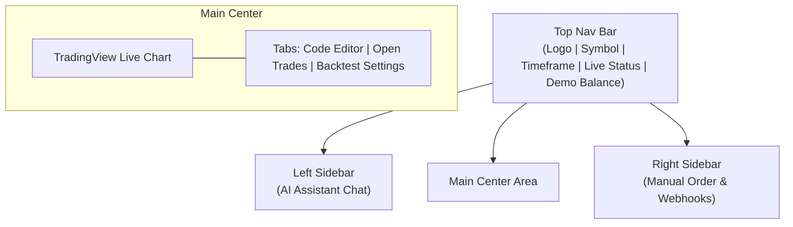

# 🚀 Product Requirements Document (PRD)
## Live Paper Trading Terminal & Signal Dispatcher

> **Status:** Draft | **Target Audience:** Engineering & Design Teams

---

## 📖 1. Product Overview & Vision

The platform is evolving from a traditional backtester into a **Live Paper Trading Terminal and Signal Dispatcher**. It serves as a continuous live data router, feeding market data simultaneously to the frontend charting interface and the backend Python execution engine.

**Core Concept:** Think TradingView's live alerts + PineScript execution, but powered by Python and executed locally or on a custom server.

---

## 🏗️ 2. System Architecture & Tech Stack

| Component | Technology | Purpose |
| :--- | :--- | :--- |
| **Frontend UI** | React / TypeScript | Default live view, manual order panel, AI chat. |
| **Charting** | TradingView Advanced Charts | Visualizing live data, supporting drawing shapes (trendlines, Fib). |
| **Backend Server** | Rust (Axum + Tokio) | Manages live WebSocket feeds, routes data, HTTP API. |
| **Live Data Ingestion** | Rust WebSocket Client | Connects to exchanges (Binance, Polygon.io) for live ticks. |
| **Execution Engine** | Rust + PyO3 | Runs Python scripts on live data or historical data. |
| **Paper Trading** | Rust Simulator Module | Tracks demo balance, executes manual/bot orders, manages TP/SL. |
| **Webhook Dispatcher** | Rust (reqwest crate) | Sends HTTP POST requests to external URLs upon strategy triggers. |
| **Database** | PostgreSQL | Stores saved backtests, user settings, AI chat history. |

---

## 🗺️ 3. Phased Implementation Plan

### Phase 1: Live Charting & Manual Paper Trading (The Default View)
* **Live Data Feed:** Rust service connecting to a live market data provider (e.g., Binance WebSocket for crypto, Polygon.io for stocks/forex).
* **Frontend Default View:** React app opens directly into the Live Chart.
* **Advanced Charting:** Integrate TradingView Advanced Charts to gain access to built-in drawing tools.
* **Manual Order Panel:** UI component for "Demo Account" allowing input of Lot Size, Take Profit (TP), and Stop Loss (SL) with Buy/Sell triggers.
* **Simulator Engine:** Rust logic to track demo account balance. Tracks live price and automatically closes manual trades if TP or SL is hit.

### Phase 2: Live Strategy Execution & Webhooks
* **Strategy Attachment:** UI button ("Deploy Strategy") to send Python code from the Monaco Editor to the Rust backend.
* **Live Python Execution:** Rust initializes PyO3 environment. Each live tick/candle is passed to Python `on_tick()` or `on_candle()`.
* **Signal Generation:** Rust intercepts `buy()` or `sell()` commands executed in Python.
* **Action Routing:**
  1. Executes the trade in the Paper Trading Simulator.
  2. If a Webhook URL is set, Rust fires an asynchronous HTTP POST request (via `reqwest`) with signal data.

### Phase 3: Backtesting & Saving Results
* **Backtest Engine:** Implement 500ms batched WebSocket streaming for historical data.
* **Database Integration:** PostgreSQL tables for saving backtests.
* **Save Functionality:** "Save Result" button on backtest completion sends payload to Rust for persistent storage.

**Database Schema (Saved Backtests):**
| Column | Type | Description |
| :--- | :--- | :--- |
| `id` | UUID | Unique identifier. |
| `strategy_name` | String | User-given name (e.g., "MACD Crossover V2"). |
| `symbol` | String | Trading pair (e.g., "BTCUSDT"). |
| `timeframe` | String | e.g., "1m", "1h", "1d". |
| `start_time` | Timestamp | Historical start date of the test. |
| `end_time` | Timestamp | Historical end date of the test. |
| `initial_balance`| Float | Starting demo money. |
| `final_balance` | Float | Ending demo money. |
| `net_profit` | Float | Total profit/loss. |
| `total_trades` | Integer | Number of executed orders. |
| `trade_history` | JSONB | Full array of open/close orders for chart rendering. |
| `python_code` | Text | Exact script used for later review. |

### Phase 4: AI Chat Integration
* **Interface:** Chat interface built alongside the live chart.
* **API Integration:** Connects to OpenAI/Anthropic API.
* **Contextual Awareness:** AI reads current chart context (symbol, timeframe) to provide tailored strategy generation and debugging.

---

## ⚠️ 4. Crucial Considerations & Constraints

> [!WARNING]
> **The Drawing Tools Limitation:** Standard open-source charting libraries lack drawing tools. Integration of TradingView Advanced Charts (via GitHub access request) is mandatory. Custom SVG overlays are too complex to maintain.

> [!CAUTION]
> **State Management for Live Bots:** If the server restarts, live Python strategies will halt and the demo account may lose track of open trades. Open paper trade states must be saved continuously to PostgreSQL for restoration.

> [!IMPORTANT]
> **Webhook Latency:** Webhooks sent to slow servers can block the Rust engine. Rust `reqwest` calls MUST be spawned as separate asynchronous Tokio tasks so they don't delay the live price feed.

---

## 📡 5. Webhook Dispatcher JSON Payload Specification

When a Python strategy triggers a trade, the Rust backend sends an HTTP POST request to the specified URL.

```json
{
  "event_type": "strategy_signal",
  "timestamp": "2026-05-09T12:55:00Z",
  "strategy": {
    "id": "strat_8f92a1b",
    "name": "MACD Crossover V2"
  },
  "trade": {
    "symbol": "EURUSD",
    "action": "BUY",
    "order_type": "MARKET",
    "price": 1.0954,
    "quantity": 1.5,
    "take_profit": 1.1050,
    "stop_loss": 1.0900
  },
  "account": {
    "mode": "paper_trading",
    "current_balance": 10150.50
  },
  "security_token": "user_defined_secret_key_123"
}
```

**Payload Field Breakdown:**

| Field | Type | Description |
| :--- | :--- | :--- |
| `event_type` | String | Identifies the webhook type. |
| `timestamp` | ISO 8601 | Exact UTC time the signal was generated. |
| `trade.action` | String | `BUY` or `SELL`. |
| `trade.order_type`| String | `MARKET` (execute immediately) or `LIMIT` (wait for price). |
| `trade.quantity` | Float | The lot size or amount to trade. |
| `trade.take_profit`| Float | Target exit price (can be `null`). |
| `trade.stop_loss` | Float | Target stop loss price (can be `null`). |
| `security_token` | String | Secret key to verify webhook authenticity. |

---

## 🖥️ 6. Live View UI Layout Map (Default View)

The layout follows a Modern IDE / Terminal Grid layout (VS Code + Binance).



**Visual Wireframe Layout:**

```text
+-----------------------------------------------------------------------------+
|  [Logo]  | Symbol: [ EURUSD ⌄ ] | Timeframe: [ 1H ⌄ ] | Demo Balance: $10k  |
+-------------------------+---------------------------------------+-----------+
|                         |                                       |           |
|     LEFT SIDEBAR        |            MAIN CENTER AREA           | RIGHT BAR |
|                         |                                       |           |
|  [ AI Assistant ]       |  +---------------------------------+  | [ Order ] |
|                         |  |                                 |  |         |
|  User: Write a MACD     |  |     TradingView Lightweight     |  | Lot Size|
|  strategy for 1H.       |  |     Chart (Live Streaming)      |  | [ 1.0 ] |
|                         |  |                                 |  |         |
|  AI: Here is the code.  |  |                                 |  | TP Price|
|  [ Apply Code Button ]  |  +---------------------------------+  | [     ] |
|                         |  | Tabs: [Code Editor] [Open Trades] |  |         |
|  User: Explain this.    |  +---------------------------------+  | SL Price|
|                         |  | def on_tick(tick):              |  | [     ] |
|  AI: It buys when...    |  |     if macd > signal:           |  |         |
|                         |  |         buy(lots=1)             |  | [ BUY ] |
|                         |  |                                 |  | [ SELL] |
|                         |  | [ Deploy Strategy to Live ]     |  |         |
| [ Chat Input Box... ]   |  |                                 |  | [ Webhk]|
+-------------------------+---------------------------------------+-----------+
```

### Layout Component Behavior:
* **Header Bar:** Global controls for symbol/timeframe, a pulsing green dot for WebSocket connection status, and persistent Demo Balance display.
* **Left Sidebar (AI Chat):** Dedicated to the AI assistant. Includes an "Apply to Editor" button to instantly move generated code to the bottom-center panel.
* **Main Center Area (Split Vertically):**
  * **Top Half (Chart):** TradingView Chart, updating live, displaying execution arrows for manual/bot trades.
  * **Bottom Half (Tabbed Panel):**
    * *Tab 1: Code Editor (Monaco)* - Where the Python strategy lives with a "Deploy Strategy" button.
    * *Tab 2: Open Positions & History* - Data table showing live paper trades and past results.
    * *Tab 3: Backtest Settings* - Configuration for historical runs.
* **Right Sidebar (Manual Order & Webhook Panel):** Inputs for Lot Size, TP, SL, BUY/SELL buttons, and Webhook URL/Token configuration.
